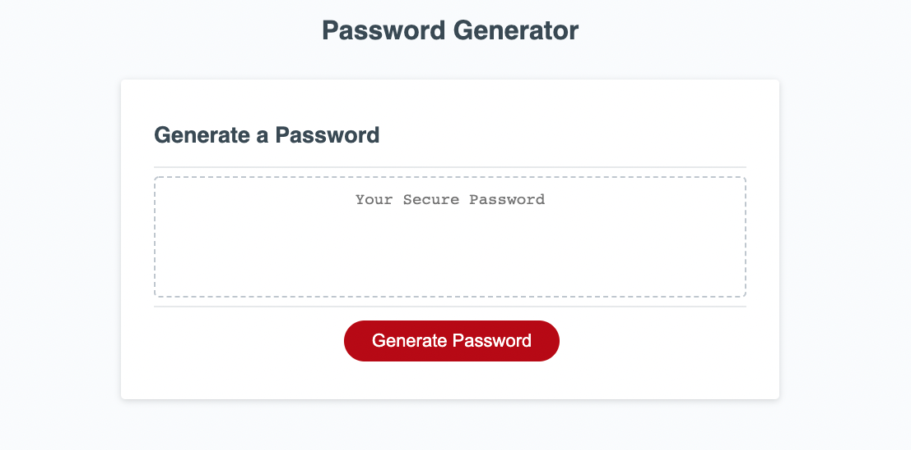
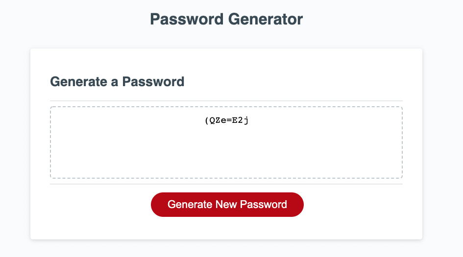

# passwordGenerator

## The Task

Given a webpage with HTML, CSS, write the needed Javascript to generate a password meeting the users requirements.

## Acceptance Criteria

```
Click the button to generate a password
User is prompted for selection of password criteria including:
lowercase, uppercase, numeric and/or special characters
User is given the choice to include/exclude each of the criteria
Length is at least 8 characters and no more than 128 characters
Password must be validated to meet all requirements asked for
When the password is generated it is written to the page
```

## Screenshots





## Links

Github: https://github.com/aaaziz2/passwordGenerator

Live Link: https://aaaziz2.github.io/passwordGenerator/